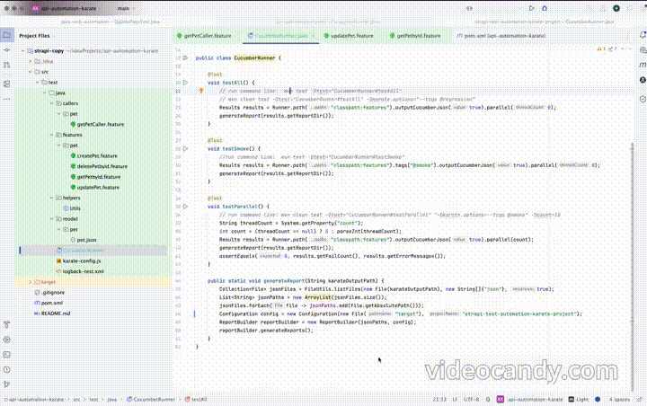

# Pet Services Test Automation with Karate


This repository includes test automation for Strapi services using the [Karate](https://github.com/karatelabs/karate) framework.

---

## 🛠 Tool Stack

- **Karate Framework** – API testing DSL
- **Java / JavaScript / Scala** – Custom logic support
- **IntelliJ IDEA** – Preferred IDE
- **Maven** – Build & dependency management

---

## ▶️ Running Tests

### 1. From IntelliJ
- Click the green Run button on any feature file to execute it.
### 2. From CLI
You can run tests with a runner class and tags:

```bash
mvn clean test -Dtest=RunnerName "-Dkarate.options=--tags @tagName"
```

